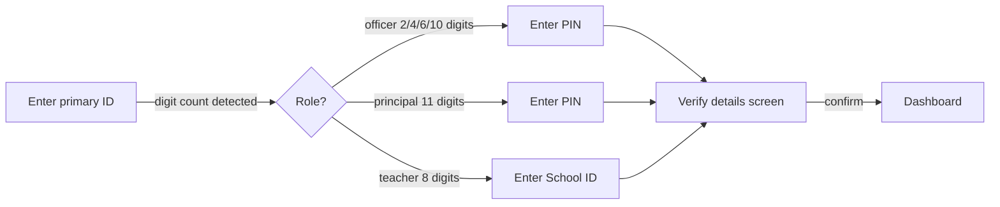

# Pocket VSK — Vidya Samiksha Kendra (Gujarat)

One platform for school-performance KPIs across every level of the Gujarat education system. **Insight-first** design: lead with the one or two things that matter, glanceable in 3 seconds, uncluttered. Audience spans from the Principal Secretary down to every teacher.

Config-driven and KPI-agnostic — the entire dashboard renders from `frameworks` / `kpi_definitions` / `kpi_values`. Built on the **4A Input–Output model**: **Attendance** (30%) · **Assessment** (30%) · **Administration** (40%) compose the **Input Composite**, with **School Quality (GSQAC)** as the standalone output domain. Fully bilingual (English + ગુજરાતી), mobile-first, with anonymised demo data backed by deterministic seeding.

---

## Table of Contents

1. [Product Overview](#product-overview)
2. [Key Capabilities](#key-capabilities)
3. [Tech Stack](#tech-stack)
4. [Architecture Overview](#architecture-overview)
5. [File and Folder Structure](#file-and-folder-structure)
6. [KPI Catalog](#kpi-catalog)
7. [Environment Variables](#environment-variables)
8. [Setup Instructions](#setup-instructions)
9. [Available Scripts](#available-scripts)
10. [User Roles and Permissions](#user-roles-and-permissions)
11. [Core User Flows](#core-user-flows)
12. [Feature Limitations and Known Gaps](#feature-limitations-and-known-gaps)
13. [Testing](#testing)
14. [Deployment](#deployment)
15. [Troubleshooting](#troubleshooting)
16. [Contribution Guidelines](#contribution-guidelines)

---

## Product Overview

The Pocket VSK is a **school-performance intelligence dashboard** built for Gujarat's Vidya Samiksha Kendra (VSK). It aggregates data from six systems (UDISE+, DIKSHA, GSQAC, SAT/ORF, NMMS, PM SHRI) into a single view, enabling every stakeholder — from teachers to State officers — to monitor their KPIs without navigating multiple portals.

The product solves three problems:

1. **Fragmented visibility** — each department sees only its own slice. VSK needed one place.
2. **Level mismatch** — the same indicator means different things at school vs block vs state. The portal renders each level's own published figure with per-entity variation, so every level is compared correctly against its N+1 peer.
3. **Punitive framing** — existing reports highlighted underperformers. VSK asked for empathetic, growth-oriented copy and RAG labelling.

---

## Key Capabilities

### Scorecard Homepage

- **Overall score ring** — Input Composite (0–100%) + GSQAC grade badge, with a one-line "what changed this week" delta sentence.
- **Domain summary cards** — five scannable rows (Attendance, Assessment, Administration, School Quality) showing the hero indicator value, N+1 benchmark, and trend delta.
- **Top Indicators strip** — high-priority intervention KPIs surfaced directly on the homepage, bypassing domain navigation.
- **PM SHRI filter** — toggle All / PM SHRI / Non-PM SHRI schools; scopes every aggregate on the page.

### KPI Cards (Domain View)

- **Single-metric cards** — headline label (Rate / Count / Score / Latest), large value, delta chip, parent average, and source line.
- **Multi-metric cards** — SAT1, SAT2, ORF, CET, CGMS each show 2–3 aligned metric rows (Avg score · Below hierarchy avg · Participation) in a single compact table.
- **Equal-height grid rows** — all cards in a grid row stretch to the same height (`sm:auto-rows-fr`).
- **No card-level graphs** — trend charts appear only on the KPI detail page; cards are for status scanning.

### KPI Detail Page

- Full value + N+1 cascade comparison (this entity → State) at a glance.
- Frequency-aware trend chart (daily 30-day / monthly / semi-annual / yearly).
- "How it's calculated" formula panel.
- Multi-metric indicators: 3-column summary grid + one trend panel per sub-metric.

### Compare View

- Small-multiples of every KPI with value · benchmark · RAG status.
- "Add comparison" multi-select (with Select All) scoped to peer entities or one level below.
- Grouped comparison bars when multiple entities are selected.

### Leaderboard

- Peer ranking (siblings at the same level) by Input Composite.
- Top Movers section (biggest WoW deltas).

### Section Comparison (Teacher / Principal)

- Cross-section comparison of any KPI across classes within scope.
- Grade picker + KPI picker.

### Export

- Download scorecard data as Excel / CSV / PDF (role-scoped).

### Role-Specific Views

| View               | Roles                                                                                                                                                                              |
| ------------------ | ---------------------------------------------------------------------------------------------------------------------------------------------------------------------------------- |
| **Teacher view**   | Teacher — TPD tracker (38/50 hrs, 7-day trend), Classroom Pulse (students at risk), evaluation status                                                                              |
| **Principal view** | Principal — School vs State comparison, GSQAC scoreboard, compliance benchmarks (PTR, class capacity, enrolment, chronic absence), attendance-gap detector with **Download Names** |

### Bilingual Support

- Full English ↔ ગુજરાતી toggle in the top navigation.
- Gujarati numerals (૦–૯) throughout when `lang === "gu"`.
- All KPI names, domain names, level labels, and UI copy translated.

---

## Tech Stack

| Layer                  | Technology                                                             |
| ---------------------- | ---------------------------------------------------------------------- |
| **Frontend framework** | React 18.3.1                                                           |
| **Language**           | TypeScript 5.6.3 (strict mode, `noUnusedLocals`, `noUnusedParameters`) |
| **Build tool**         | Vite 5.4.11                                                            |
| **Styling**            | Tailwind CSS 3.4.15 (custom design system)                             |
| **Charts**             | Recharts 2.13.3                                                        |
| **Routing**            | React Router DOM v6.28                                                 |
| **State management**   | Zustand 5.0.1 + localStorage persistence                               |
| **Icons**              | Lucide React                                                           |
| **Fonts**              | Montserrat (Latin), Mukta (Gujarati)                                   |
| **Testing**            | Playwright (E2E, configured; no unit test framework)                   |
| **Database (live)**    | Supabase (PostgreSQL + RLS) — stub wired, not active                   |
| **Data (demo)**        | Deterministic MockProvider (seeded PRNG, per-level anchored)           |
| **Deployment**         | Vercel (SPA rewrite rules via `vercel.json`)                           |
| **Package manager**    | npm                                                                    |

---

## Architecture Overview

```
┌─────────────────────────────────────────────────────────┐
│                        Browser                          │
│                                                         │
│  React 18 + Zustand session store                       │
│    ├── AppShell (nav, breadcrumb, PM SHRI filter)       │
│    ├── Screens (Login → Home → Domain → KpiDetail …)    │
│    └── UI Components (cards, charts, tables, atoms)     │
│                                                         │
│  Hooks (useScorecard, useKpiRecord, useKpiMetrics …)    │
│    │                                                     │
│  Engine (score.ts · rag.ts · trend.ts · story.ts …)     │
│    │                                                     │
│  DataProvider ◄─── VITE_DATA_PROVIDER env var           │
│    ├── MockProvider (bundled seed JSON)                  │
│    └── SupabaseProvider (stub — wire in for production)  │
│                                                         │
│  Config (frameworks.ts · kpiCatalog.ts · ratingBands.ts)│
└─────────────────────────────────────────────────────────┘
```

### Frontend Structure

- **Screens** (`src/screens/`) — full-page views, one per route.
- **Components** (`src/components/`) — layout shells (`AppShell`, `PageSection`) and UI primitives (cards, charts, badges, tables).
- **Config** (`src/config/`) — all domain definitions, KPI catalog, rating bands, and applicability rules. **No KPI metadata is in component code.**
- **Engine** (`src/engine/`) — pure TypeScript functions: scoring, RAG status, trend history, leaderboard, cascade. No React, no side effects.
- **Hooks** (`src/hooks/index.ts`) — thin React wrappers around engine functions; drive re-renders when session state changes.

### Data Layer

The `DataProvider` interface (`src/data/provider/types.ts`) is the single seam between UI and storage. Swap providers by setting `VITE_DATA_PROVIDER`:

| Provider         | When to use                                                          |
| ---------------- | -------------------------------------------------------------------- |
| `mock` (default) | Development, demo, CI — no backend needed                            |
| `supabase`       | Production — requires `VITE_SUPABASE_URL` + `VITE_SUPABASE_ANON_KEY` |

**MockProvider** loads bundled seed JSON (real Gujarat entity names + GSQAC scores), then derives per-entity values deterministically from a per-entity `anchor` (0..1) so averages at every level match published figures while individual entities vary for RAG/leaderboard purposes.

### Scoring Model

```
Input Composite = Σ (domain_weight × domain_%)
                  ─────────────────────────────   × 100
                  Σ (domain_weight for non-NA domains)

Domain % = weighted mean of constituent KPI normalized scores
           (or sub-domain mean for multi-sub-domain domains)

KPI normalized score:
  • higher-is-better %/score  →  value itself
  • lower-is-better %         →  100 − value
  • count/days vs benchmark   →  achievement %, capped 100, direction-aware

GSQAC (School Quality) = published aggregate, shown as-is, not averaged into Input Composite
```

### Auth / Permissions Model

Login is ID-digit-length-based (no role selector):

- Role is inferred from the digit count of the primary ID.
- A second credential (PIN or School ID) is required.
- The session store (`useScope`) enforces that a user can only view entities within their own subtree (read-side clamp + write-side guard).

> **Important:** Client-side enforcement only. Production deployments **must** add server-side Row-Level Security (RLS) in Supabase.

### Routing

```
/                   → redirects to /app
/login              → Login screen
/app                → ScorecardHome (role-aware homepage)
/app/domain/:id     → DomainView (domain KPI grid)
/app/domain/:id/:sub → SubDomainView (sub-domain KPI grid)
/app/kpi/:kpiId     → KpiDetail (value + trend + cascade)
/app/compare        → CascadeComparison (small-multiples)
/app/leaderboard    → Leaderboard (peer ranking)
/app/export         → Export screen
*                   → NotFound
```

---

## File and Folder Structure

```
app/
├── public/                      Static assets (favicon, etc.)
├── src/
│   ├── config/                  ← All KPI & framework metadata (no magic strings in UI)
│   │   ├── kpiCatalog.ts        43 KPI definitions + PUBLISHED per-level figures
│   │   ├── frameworks.ts        4A model config (Attendance/Assessment/Administration + GSQAC)
│   │   ├── ratingBands.ts       GSQAC grade scale (A++++ → D) + RAG thresholds
│   │   ├── applicability.ts     Level + role visibility rules (kpiApplies)
│   │   ├── complianceBands.ts   Compliance threshold config
│   │   └── index.ts             Config barrel + PERIODS array (8 weeks)
│   │
│   ├── types/
│   │   └── index.ts             Domain types (Entity, KpiDef, KpiMetricDef, Scorecard…)
│   │
│   ├── engine/                  ← Pure TS scoring logic (no React)
│   │   ├── index.ts             Public API (getScorecard, getKpiRecord, getKpiMetricRecords…)
│   │   ├── score.ts             KpiRecord builder, domain/overall scoring, metricKpiDef()
│   │   ├── rag.ts               Normalized score → RAG status
│   │   ├── trend.ts             Frequency-aware trend history + delta
│   │   ├── story.ts             Growth-oriented one-liner narrative (bilingual)
│   │   ├── leaderboard.ts       Entity ranking by overall score
│   │   └── rollup.ts            Cascade comparisons (level → N+1)
│   │
│   ├── hooks/
│   │   └── index.ts             React hooks: useScorecard, useKpiRecord, useKpiMetrics…
│   │
│   ├── lib/                     ← Utilities (no React)
│   │   ├── trend.ts             buildTrend(), getLastUpdatedLabel(), cadenceOf()
│   │   ├── peer.ts              peerLevelOf(), peerAvg(), peerGapOf()
│   │   ├── format.ts            locNum(), formatValue(), formatDate(), getWorkingDateLabel()
│   │   ├── colors.ts            RAG + grade group + accent colour maps
│   │   └── cn.ts                Tailwind class utility (clsx-like)
│   │
│   ├── i18n/
│   │   ├── en.ts                English dictionary (source of truth, shape-checked)
│   │   ├── gu.ts                Gujarati dictionary (mirrors en.ts shape)
│   │   └── index.ts             useT() hook (t, tn, pick, lang)
│   │
│   ├── store/
│   │   └── session.ts           Zustand store: user, scopeId, lang, pmShri, frameworkId
│   │
│   ├── data/
│   │   ├── provider/
│   │   │   ├── types.ts         DataProvider interface
│   │   │   ├── index.ts         Provider selector (mock vs supabase)
│   │   │   ├── mockProvider.ts  Deterministic seeded provider (per-level anchoring)
│   │   │   ├── supabaseProvider.ts  Live DB stub (not yet implemented)
│   │   │   └── seed/
│   │   │       ├── entities.json    Org hierarchy (state → section, real Gujarat names)
│   │   │       ├── appUsers.json    Demo login accounts
│   │   │       └── meta.json        GSQAC scores + real-data overrides
│   │   └── prng.ts              Deterministic noise generator (seedable PRNG)
│   │
│   ├── components/
│   │   ├── layout/
│   │   │   ├── AppShell.tsx     Nav, breadcrumb, PM SHRI filter, language toggle
│   │   │   ├── ScreenContainer.tsx  Page padding + max-width wrapper
│   │   │   ├── PageHeader.tsx   Title + icon + back link
│   │   │   ├── PageSection.tsx  Section label + responsive KPI grid (sm:auto-rows-fr)
│   │   │   ├── LanguageToggle.tsx   EN ↔ ગુ switcher
│   │   │   ├── PmShriFilter.tsx     All / PM SHRI / Non-PM SHRI toggle
│   │   │   └── Breadcrumb.tsx   Scope navigation trail
│   │   │
│   │   └── ui/
│   │       ├── atoms.tsx            Badge, Button, Card, SectionLabel, EmptyNA
│   │       ├── kpiCardParts.tsx     Shared card shells (KpiCardShell, KpiMetricRow, KpiSourceLine…)
│   │       ├── KpiCard.tsx          Single-metric indicator card
│   │       ├── MultiMetricKpiCard.tsx  Multi-metric card (SAT/ORF/CET/CGMS)
│   │       ├── HeroKpiStrip.tsx     Homepage hero indicator strip
│   │       ├── DomainSummaryCard.tsx   Domain overview card
│   │       ├── GsqacSummaryCard.tsx    GSQAC school quality card
│   │       ├── TrendChart.tsx       Recharts line chart (cadence-aware x-axis)
│   │       ├── Sparkline.tsx        Micro inline chart (not used on KPI cards)
│   │       ├── RatingRing.tsx       SVG score ring + grade badge
│   │       ├── RatingBadge.tsx      Grade group badge (A / B / C / D)
│   │       ├── ValueDisplay.tsx     Value + status tone formatting
│   │       ├── FrequencyDelta.tsx   Δ with arrow, cadence-aware label
│   │       ├── DataBadges.tsx       Frequency chip, context chips
│   │       ├── NPlusOneLine.tsx     "Parent · level · value" comparison line
│   │       ├── ComparisonBars.tsx   Horizontal benchmark bars
│   │       ├── Leaderboard.tsx      Ranked entity table
│   │       ├── SchoolRiskTable.tsx  Principal-view risk table
│   │       ├── ResponsiveDataTable.tsx  Generic data table
│   │       ├── Select.tsx / MultiSelect.tsx  Dropdown controls
│   │       ├── Tooltip.tsx          Popover tooltip
│   │       └── Icon.tsx             Lucide icon wrapper
│   │
│   ├── screens/
│   │   ├── Login.tsx            Role-detection login (digit-length-based)
│   │   ├── ScorecardHome.tsx    Homepage (domain cards + GSQAC + top indicators)
│   │   ├── DomainView.tsx       Domain detail — KPI grid with KpiCardAuto routing
│   │   ├── SubDomainView.tsx    Sub-domain KPI grid (Administration breakdown)
│   │   ├── KpiDetail.tsx        KPI detail (value + trend chart + cascade + formula)
│   │   ├── CascadeComparison.tsx   Small-multiples comparison view
│   │   ├── Leaderboard.tsx      Peer ranking screen
│   │   ├── Export.tsx           Data export (Excel / CSV / PDF)
│   │   └── NotFound.tsx         404 page
│   │
│   ├── App.tsx                  Router setup
│   └── main.tsx                 React DOM root
│
├── scripts/
│   ├── seed.mjs                 Seed data generator (GSQAC CSV → JSON)
│   ├── verify.mjs               Runtime integrity checks
│   └── smoke.mjs                Smoke test (data + engine sanity)
│
├── supabase/                    (Optional) Supabase schema + seed SQL
├── Docs/                        Source data (KPI sheet, GSQAC CSV)
├── index.html                   Vite entry point
├── vite.config.ts
├── tsconfig.json
├── tailwind.config.ts
├── postcss.config.js
├── vercel.json                  Vercel SPA rewrite config
├── .env.example                 Environment variable template
├── .gitattributes               GitHub Linguist overrides (SQL → vendored)
└── QA_REPORT.md                 Living QA log
```

---

## KPI Catalog

43 indicators across four domains. Each KPI is fully parameterized: name, unit, direction, frequency, display strategy, formula, level applicability, role visibility, and published per-level anchors.

### Attendance

| ID            | Name                                 | Unit  | Frequency | Multi-metric |
| ------------- | ------------------------------------ | ----- | --------- | ------------ |
| `att_teacher` | Teacher Attendance                   | %     | Daily     | —            |
| `att_student` | Student Attendance                   | %     | Daily     | —            |
| `att_mdm`     | Mid-Day Meal coverage                | %     | Daily     | —            |
| `att_chronic` | Chronic Absenteeism                  | %     | Monthly   | —            |
| `att_report`  | SAT reports downloaded in classrooms | count | Monthly   | —            |

### Assessment

| ID                | Name                                 | Unit  | Frequency          | Sub-metrics                                     |
| ----------------- | ------------------------------------ | ----- | ------------------ | ----------------------------------------------- |
| `asm_sat1`        | SAT 1 Results                        | %     | Twice a Year (Sep) | Avg score · Below hierarchy avg · Participation |
| `asm_sat2`        | SAT 2 Results                        | %     | Twice a Year (Mar) | Avg score · Below hierarchy avg · Participation |
| `asm_orf`         | Oral Reading Fluency (ORF)           | score | Twice a Year       | CWPM · Below hierarchy avg · Participation      |
| `asm_cet`         | CET Results                          | %     | Yearly             | Result · Participation                          |
| `asm_cgms`        | NMMS / CGMS Results                  | %     | Yearly             | Result · Participation                          |
| `asm_remediation` | SAT reports downloaded in classrooms | count | Monthly            | — (as-on display)                               |

### Administration (4 sub-domains)

**School Observation**

| ID                   | Name                         | Unit  | Frequency |
| -------------------- | ---------------------------- | ----- | --------- |
| `vis_crc_count`      | CRC Visits                   | count | Monthly   |
| `vis_obs_completion` | Observation Completion       | %     | Monthly   |
| `vis_ict`            | ICT Lab Utilisation          | %     | Monthly   |
| `vis_library`        | Library Utilisation          | %     | Monthly   |
| `vis_urinals`        | Urinals Functional           | %     | Monthly   |
| `vis_handwash`       | Handwash Stations Functional | %     | Monthly   |
| `vis_water`          | Safe Drinking Water          | %     | Monthly   |
| `vis_smc`            | SMC Meetings Conducted       | %     | Monthly   |

**Classroom Observation**

| ID                  | Name                     | Unit  | Frequency |
| ------------------- | ------------------------ | ----- | --------- |
| `vis_classroom_obs` | Classroom Observations   | count | Monthly   |
| `vis_lesson_plan`   | Lesson Plan Completion   | %     | Monthly   |
| `vis_teacher_diary` | Teacher Diary Completion | %     | Monthly   |

**Student Retention**

| ID             | Name              | Unit | Frequency |
| -------------- | ----------------- | ---- | --------- |
| `ret_dropout`  | Drop-out Rate     | %    | Yearly    |
| `ret_reenroll` | Re-enrolment Rate | %    | Yearly    |

**CPD (Continuous Professional Development)**

| ID          | Name                        | Unit  | Frequency |
| ----------- | --------------------------- | ----- | --------- |
| `cpd_hours` | Teacher Training Hours      | hours | Monthly   |
| `cpd_50`    | Teachers with ≥50h Training | %     | Yearly    |

### School Quality (GSQAC Output)

| ID         | Name                               | Description                                  |
| ---------- | ---------------------------------- | -------------------------------------------- |
| `sq_gsqac` | GSQAC Overall Score                | Composite school quality accreditation score |
| `sq_d1`    | D1 — Learning & Teaching           | Pedagogy, FLN, classroom practices           |
| `sq_d2`    | D2 — School Administration         | Leadership, records, governance              |
| `sq_d3`    | D3 — Co-curricular Activities      | Sports, arts, clubs                          |
| `sq_d4`    | D4 — Resources & their Use         | Infrastructure, ICT, library                 |
| `sq_d5`    | D5 — Participation in Scholarships | Scholarship uptake and outreach              |

### Multi-metric Architecture

For indicators with `metrics: KpiMetricDef[]`, sub-metric data is anchored separately in `METRIC_PUBLISHED` using keys of the form `<parentId>__<metricId>` (e.g. `asm_sat1__belowHierarchyAvg`). `metricKpiDef()` synthesizes a full `KpiDef` for each sub-metric so the existing engine / provider / peer machinery works without modification. `useKpiMetrics` is always called (even for single-metric KPIs) to preserve stable hook order.

---

## Environment Variables

| Variable                 | Required             | Description                                     | Example                    |
| ------------------------ | -------------------- | ----------------------------------------------- | -------------------------- |
| `VITE_DATA_PROVIDER`     | No                   | Which data provider to use. Defaults to `mock`. | `mock` or `supabase`       |
| `VITE_SUPABASE_URL`      | Only with `supabase` | Supabase project URL                            | `https://xxxx.supabase.co` |
| `VITE_SUPABASE_ANON_KEY` | Only with `supabase` | Supabase anonymous public key                   | `eyJhbGci...`              |

Copy `.env.example` to `.env.local` and fill in values. In development the `mock` provider requires no credentials.

---

## Setup Instructions

### Prerequisites

- Node.js ≥ 18 (LTS recommended)
- npm ≥ 9

### 1. Install dependencies

```bash
cd app
npm install
# If npm is blocked by PowerShell execution policy:
npm.cmd install
```

### 2. Configure environment

```bash
cp .env.example .env.local
# Edit .env.local — for development, VITE_DATA_PROVIDER=mock requires no further changes
```

### 3. (Optional) Regenerate seed data

The committed seed JSON in `src/data/provider/seed/` is pre-generated and checked in. Only re-run if you update `Docs/GJ _ Unified App KPIs.xlsx` or the GSQAC CSV:

```bash
npm run seed
```

### 4. Run the development server

```bash
npm run dev
# Opens at http://localhost:5173
```

### 5. Type-check

```bash
npm run typecheck
```

### 6. Build for production

```bash
npm run build
# Output in dist/
```

### 7. Verify data integrity

```bash
node scripts/verify.mjs   # checks published anchors and config consistency
node scripts/smoke.mjs    # runtime engine sanity checks
```

---

## Available Scripts

| Script         | Command                  | Description                                               |
| -------------- | ------------------------ | --------------------------------------------------------- |
| **Dev server** | `npm run dev`            | Start Vite dev server on port 5173 with HMR               |
| **Build**      | `npm run build`          | TypeScript check + Vite production bundle → `dist/`       |
| **Type-check** | `npm run typecheck`      | Run `tsc --noEmit` (strict, no build artefacts)           |
| **Seed**       | `npm run seed`           | Regenerate `src/data/provider/seed/*.json` from GSQAC CSV |
| **Verify**     | `npm run verify`         | Runtime config + data integrity assertions                |
| **Smoke**      | `node scripts/smoke.mjs` | Engine sanity checks (no test framework needed)           |
| **Preview**    | `npm run preview`        | Serve the production build locally                        |
| **E2E tests**  | `npx playwright test`    | Run Playwright end-to-end tests                           |

---

## User Roles and Permissions

Role is inferred from the digit length of the user's primary ID — no role picker in the UI.

| Role             | ID Digits         | Scope         | Drill-down          |
| ---------------- | ----------------- | ------------- | ------------------- |
| `state`          | 2                 | Entire state  | → Districts         |
| `deo` (District) | 4                 | One district  | → Blocks            |
| `brc` (Block)    | 6                 | One block     | → Clusters          |
| `crc` (Cluster)  | 10                | One cluster   | → Schools           |
| `principal`      | 11 (school UDISE) | One school    | → Grades → Sections |
| `teacher`        | 8                 | One classroom | Section only        |

### Demo Accounts

| Level              | Demo ID       | Second credential       |
| ------------------ | ------------- | ----------------------- |
| State              | `24`          | PIN `0000`              |
| District (DEO)     | `2401`        | PIN `3456`              |
| Block (BRC)        | `240101`      | PIN `2345`              |
| Cluster (CRC)      | `2401010001`  | PIN `1234`              |
| School / Principal | `24010100011` | PIN `1111`              |
| Teacher            | `24000009`    | School ID `24010100011` |

Use the **"Demo logins ▾"** helper on the login screen to prefill any account.

### KPI Visibility Rules

KPIs are gated on two axes, configured in `src/config/applicability.ts`:

1. **Level gate** (`kpi.lowestLevel`) — the lowest hierarchy level an indicator is shown at. School-and-above indicators (teacher attendance, MDM, all Administration, GSQAC) are hidden at grade/section. Classroom indicators (student attendance, chronic absence, all Assessment) go down to section.
2. **Role gate** (`kpi.roleVisibility`) — certain KPIs are restricted to non-teacher roles (e.g. CET/CGMS) even when the level applies.

KPIs that don't apply are hidden entirely — they never appear as "NA" clutter.

---

## Core User Flows

### Login



### Homepage → Domain → KPI Detail

1. Land on **ScorecardHome** — see overall score ring, domain cards, top indicators.
2. Tap a domain card → **DomainView** — scan all KPI cards for that domain.
3. Tap a KPI card → **KpiDetail** — full value, trend chart, cascade (all levels), formula.
4. Tap **Back** to return to the domain list.

### Drill-down (Officer views)

1. On any screen that shows entity names (leaderboard, cascade, children list), tap a name.
2. `useScope.setScope(entityId)` moves the view into that entity's subtree.
3. The breadcrumb trail tracks the path; tap any crumb to jump back up.
4. **Reset** (home icon in nav) returns to the user's own root scope.

### Compare KPIs

1. Navigate to **Compare** from the nav.
2. Use **Add comparison** to pick peer entities (multi-select, with Select All).
3. Every KPI shows a side-by-side value + RAG for each selected entity.
4. Tap any KPI cell to open its detail page.

### PM SHRI Filter

Available in the top navigation for Cluster-and-above roles:

- **All** — aggregates include all schools in scope.
- **PM SHRI** — aggregates scoped to PM SHRI-flagged schools only.
- **Non-PM SHRI** — aggregates scoped to non-PM SHRI schools.

This filter persists in the session store and affects every screen.

---

## Feature Limitations and Known Gaps

### Incomplete Features

- **Sub-domain detail for Administration** — the 4-way breakdown (School Observation / Classroom Observation / Student Retention / CPD) is fully wired as a 3-tier seam (`DomainView → SubDomainView`) but the sub-domain detail screen and its KPI cards are pending full data mapping (Chaitanya).
- **GSQAC D1–D5 sub-scores** — shown as context tiles on the GSQAC card but not independently drillable to a detail page.
- **Historical progression infographic** (FCR-3.7) — not built (deprioritised).

### Mock / Demo Data

- All values are deterministic from a seeded PRNG anchored to published per-level figures. They are not real school data.
- Sub-metric anchors (SAT1/SAT2/ORF sub-metrics) are hard-coded in `METRIC_PUBLISHED`; the live Supabase provider will need a real schema for these.
- `att_report` / `asm_remediation` display as "as on {date}" with `suppressDelta: true` — delta is not tracked for these indicators.

### Domain Weightages

`WEIGHTAGE_IS_PLACEHOLDER = true` — the 30/30/40 split is the CEO-agreed default but has not received final State sign-off. A banner in the UI flags this. **Do not treat the Input Composite as official.**

### Security

- **Client-side only** — scope enforcement (`useScope`) and role-based KPI visibility are implemented in the browser. A determined user can manipulate `localStorage` to view out-of-scope data.
- **Production requires Supabase RLS** — the schema stub in `supabase/schema.sql` must be deployed with appropriate Row-Level Security policies before this is used with real data.
- No SSO / OAuth is implemented. Login is credential-based (ID + PIN), validated only against the seed file (mock) or a Supabase table (live).

### Browser / Device

- Tested on Chrome and Safari (desktop + mobile).
- Recharts relies on SVG; very small screens (<320px) may see chart overflow.
- Gujarati font rendering depends on the Mukta webfont loading; a fallback generic sans-serif is configured.

### Other Known Issues

- Bundle size is large (~1.5 MB uncompressed) because the full mock seed (6 000+ entities) is bundled at build time. In production with a live Supabase backend, remove the seed import from `mockProvider.ts` and the bundle will shrink significantly.
- Playwright E2E tests are configured in `package.json` but no test specs are committed. All QA is currently manual (see `QA_REPORT.md`).

---

## Testing

### Test Framework

- **E2E:** Playwright (configured; no specs committed yet).
- **Engine smoke test:** `node scripts/smoke.mjs` (manual Node.js assertions).
- **Data integrity:** `node scripts/verify.mjs` (config consistency checks).
- **No unit test framework** (Vitest / Jest) is configured.

### Running Tests

```bash
# Smoke test (engine + config sanity)
node scripts/smoke.mjs

# Data integrity
node scripts/verify.mjs

# Type checking (strict)
npm run typecheck

# E2E (requires a running dev server)
npm run dev &
npx playwright test
```

### Manual QA Checklist

Refer to `QA_REPORT.md` at the repo root for the living manual test log. Key areas to verify after any change:

- [ ] All KPI cards render without empty metric rows or duplicate labels
- [ ] Period label on multi-metric cards shows `Sep 2025` / `Mar 2026` (not `September`)
- [ ] Equal-height grid rows on all 2-column+ viewports
- [ ] `suppressDelta` KPIs show "as on {date}", no delta chip
- [ ] `showLastUpdatedOnUi` KPIs show period label in card header
- [ ] Gujarati numerals render correctly when lang = "gu"
- [ ] PM SHRI filter changes aggregates across all screens
- [ ] Scope guard: teacher cannot view district-level data after localStorage manipulation
- [ ] Build passes: `npm run typecheck && npm run build`

---

## Deployment

The app deploys as a static SPA to **Vercel**.

### Build Command

```bash
npm run build
```

Output: `dist/` directory (Vite bundle, ~1.5 MB uncompressed).

### Vercel Configuration (`vercel.json`)

```json
{
  "buildCommand": "npm run build",
  "outputDirectory": "dist",
  "rewrites": [{ "source": "/(.*)", "destination": "/index.html" }]
}
```

The SPA rewrite rule ensures deep links (`/app/kpi/att_teacher`) work on direct navigation or refresh.

### Environment Variables on Vercel

Set these in the Vercel project dashboard (Settings → Environment Variables):

| Variable                 | Value                                               |
| ------------------------ | --------------------------------------------------- |
| `VITE_DATA_PROVIDER`     | `supabase` (production) or `mock` (staging/preview) |
| `VITE_SUPABASE_URL`      | Your Supabase project URL                           |
| `VITE_SUPABASE_ANON_KEY` | Your Supabase anon key                              |

### Switching to Live Supabase Data

1. Apply `supabase/schema.sql` to your Supabase project.
2. Run `supabase/seed.sql` (or load via the Supabase dashboard).
3. Load KPI config rows (domains, KPI definitions) into the corresponding tables.
4. Implement the methods in `src/data/provider/supabaseProvider.ts` (currently stubbed).
5. Set `VITE_DATA_PROVIDER=supabase` and deploy.

### Post-deployment Verification

```bash
# Check type safety
npm run typecheck

# Verify data integrity
node scripts/verify.mjs

# Manual: visit /login → use Demo logins → confirm homepage renders
```

---

## Troubleshooting

### `npm install` fails or hangs on Windows

If PowerShell blocks npm:

```powershell
npm.cmd install
```

Or open a Command Prompt (not PowerShell) and run `npm install` there.

### Vite chunk-size warning on build

Expected. The mock seed (6 000+ entities) is bundled intentionally for demo use. The warning threshold is set to 1 500 kB in `vite.config.ts`. This is not an error.

### `tsc --noEmit` fails with "unused variable"

TypeScript is configured with `noUnusedLocals` and `noUnusedParameters`. Remove the unused binding, or if it must exist (e.g. a hook return you don't use), prefix with `_` (e.g. `_unusedVar`).

### Gujarati text renders as boxes

The Mukta font may not have loaded. Check network tab for `fonts.googleapis.com` requests. In restricted network environments, self-host the font and update `index.html` accordingly.

### KPI card shows "—" for all values

The entity's level may not have a published anchor for that KPI. Check `PUBLISHED[kpiId]?.[level]` in `src/config/kpiCatalog.ts`. If `null`, the KPI is not tracked at that level and `kpiAppliesAtLevel()` should return `false` to hide it.

### Login fails with "Could not find a matching user"

Ensure you are using a demo account from the table above, or that `src/data/provider/seed/appUsers.json` contains the ID you are testing. The mock provider matches IDs exactly.

### Scope drill-down does not update charts

If `useScope` returns stale data, check that `setScope(entityId)` was called with a valid ID that exists in `entities.json` and is within the logged-in user's subtree. The session store guard silently rejects out-of-subtree IDs.

---

## Contribution Guidelines

### Branch Naming

```
feat/<short-description>        New feature
fix/<short-description>         Bug fix
refactor/<short-description>    Refactoring (no behaviour change)
docs/<short-description>        Documentation only
chore/<short-description>       Build, config, tooling
```

### Commit Style

Use short imperative subject lines (≤72 chars). No trailing periods. Body is optional but encouraged for non-obvious changes.

```
feat: add multi-metric KPI card for SAT1/SAT2

fix: remove duplicate period label on SAT cards

chore: add .gitattributes for GitHub Linguist
```

### Code Style

- TypeScript strict mode — no `any`, no unused vars/params (enforced by `tsc`).
- No hardcoded KPI IDs in component code — all metadata lives in `src/config/`.
- No hardcoded copy strings — all UI text goes through `useT()` from `src/i18n/`.
- No comments explaining _what_ the code does — only _why_ (hidden constraints, non-obvious invariants).
- No card-level graphs — trend charts belong only on `KpiDetail.tsx`.
- Do not change: KPI values, KPI formulas, KPI names, delta logic, N+1 logic, date/frequency logic, source values, access control, routing, Compare behaviour, Export behaviour, KPI detail charts, homepage navigation, GSQAC logic, or provider architecture — without explicit sign-off.

### Adding a New KPI

1. Add the `KpiDef` entry to `VSK_KPIS` in `src/config/kpiCatalog.ts`.
2. Add per-level `PUBLISHED` anchors (mandatory: at minimum one level).
3. Add i18n strings to `src/i18n/en.ts` and `src/i18n/gu.ts`.
4. Run `npm run typecheck` + `node scripts/verify.mjs` to confirm.
5. No UI component changes required for single-metric KPIs — `KpiCardAuto` routes automatically.

### PR Checklist

- [ ] `npm run typecheck` passes (zero errors)
- [ ] `npm run build` passes (no new errors; chunk-size warning is pre-existing and expected)
- [ ] Manual smoke test: login → homepage → at least one domain → KPI detail
- [ ] Gujarati rendering tested if i18n keys were added
- [ ] No hardcoded KPI IDs, copy strings, or magic numbers introduced
- [ ] `QA_REPORT.md` updated if acceptance criteria changed

### Documentation

- Update this README if new screens, env vars, scripts, or architectural patterns are introduced.
- Update `QA_REPORT.md` with test outcomes for the changed area.
- Do not create intermediate analysis or planning documents in the repo.
